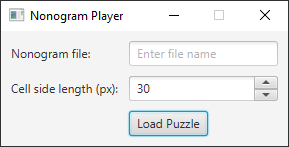
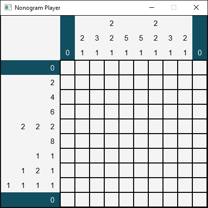
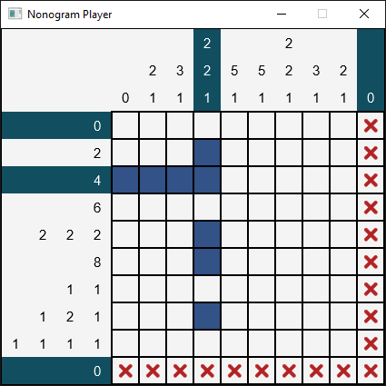
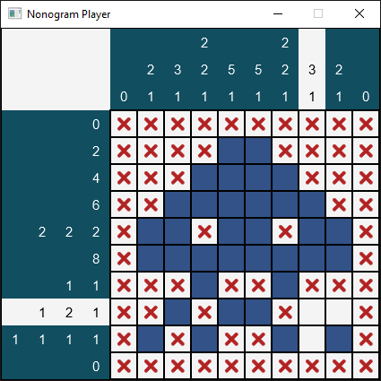
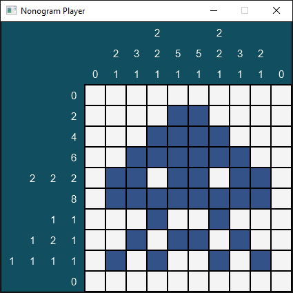
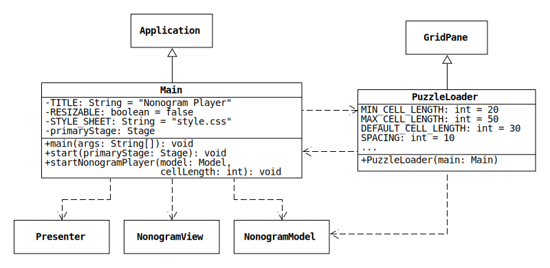
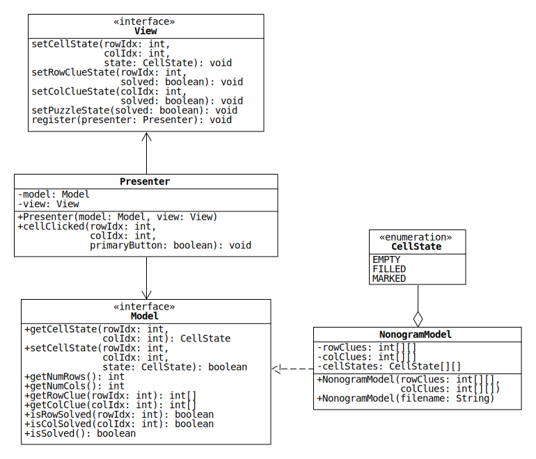
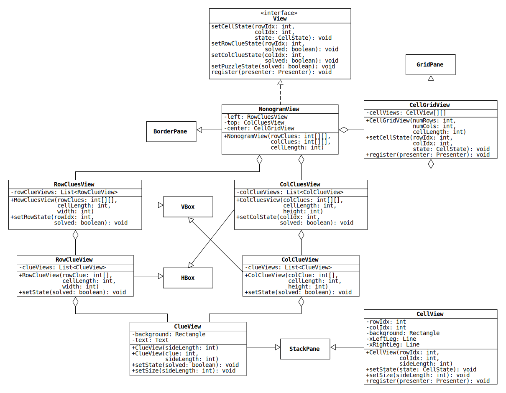

# Project 5: Nonogram Player

For Project 4, we wrote a program that creates [nonograms](https://en.wikipedia.org/wiki/Nonogram) from [binary images](https://en.wikipedia.org/wiki/Binary_image).
For our final project, we will write a video game that allows us to play those puzzles!

When the program starts, the player is shown an options menu where they choose the name of a puzzle file and the size of the grid cells.
The puzzle file must consist of plain text in the format defined in Project 4.[1](#f1)

Clicking "Load Puzzle" switches the content of the window to a graphical representation of the puzzle.
Below is an example using the file **space-invader.txt** from Project 4.
Note that the background color of the clues in the first and last rows and the first and last columns is green instead of white.[2](#f2)
This indicates that the states of the cells in these rows and columns solve the clue numbers.
In this case, the numbers are 0, so they are trivially solved by the initial (empty) states.

Left-clicking on an empty cell changes its state to filled, which is represented by the color blue.
Right-clicking changes the state to marked, which is represented by a red X.
Marked cells are treated as empty when the game checks whether a row or column is solved, but the marks can be used by the player to label cells that they know are empty.

The next image shows the puzzle after changing the states of 8 cells to filled.
The new states solve the clues in the third row and fourth column, so the background color of these clues changed to green.
The leftmost filled cell contradicts the clue in the first column, so its background color changed to white.

The cells in the bottom row and right column have all been marked.
This has no effect on the clues, but it helps to show the constraints on the other cells.
For instance, if we also mark the cells in the top row and left column, it becomes clear that the cells in the sixth row must all be filled.

The next image shows the puzzle with all but two of the clues solved.
Filling the cell in the eighth row and eighth column will solve the puzzle.
Note that some of the filled cells in the previous image were incorrect, even though the background color of the corresponding clues was green.
Individual row and column clues usually have multiple solutions, and the background color will turn green for all of them.
To solve the entire puzzle, however, the clues for all the rows and columns must be solved simultaneously.[3](#f3)

The final image shows the behavior of the program when the player solves the puzzle.
All of the marked cells are changed to empty cells, and the color of the white square in the top-left corner turns green.
Additionally, the player can no longer change the states of the cells.

## Loading the Puzzle

The UML diagram below shows the entry point to the program.

The classes Main and PuzzleLoader are similar to Main and OptionsView from Project 4.
The main method is in the Main class and does nothing but call the launch method inherited from Application.
The launch method creates the application window and an instance of Main, calls the start method on the Main object, and passes the method a reference to the window (stage).

### Main

The Main class has two instance methods that set the content of the application window.
The start method displays the options menu, and the startNonogramPlayer method displays the game.

* `start(Stage primaryStage)`: Perform these steps to display the options menu:

  1. Create a PuzzleLoader and pass its constructor a reference to the Main object.
  2. Create a [Scene](https://openjfx.io/javadoc/11/javafx.graphics/javafx/scene/Scene.html) that contains the PuzzleLoader and set it on the [Stage](https://openjfx.io/javadoc/11/javafx.graphics/javafx/stage/Stage.html).
  3. Add the application name to the title bar, prevent the stage from resizing, and then show the stage.

* `startNonogramPlayer(Model model, int cellLength)`: Perform the following steps to switch the content of the window from the options menu to the game:

  1. Create a NonogramView object.
  2. Create a Presenter object to synchronize the state of the NonogramView with the given model.
  3. Create a new scene that contains the NonogramView.
  4. Add the style sheet **style.css** to the scene.
  5. Set the new scene on the stage.

### PuzzleLoader

This class is a [GridPane](https://openjfx.io/javadoc/11/javafx.graphics/javafx/scene/layout/GridPane.html) with controls for getting the name of the puzzle file and the size of the grid cells from the user.
The class has two [Labels](https://openjfx.io/javadoc/11/javafx.controls/javafx/scene/control/Label.html), a [TextField](https://openjfx.io/javadoc/11/javafx.controls/javafx/scene/control/TextField.html), a [Spinner](https://openjfx.io/javadoc/11/javafx.controls/javafx/scene/control/Spinner.html), and a [Button](https://openjfx.io/javadoc/11/javafx.controls/javafx/scene/control/Button.html).

* Give the spinner a minimum value of 20, a maximum value of 50, and an initial value of 30.

* Add an [EventHandler](https://openjfx.io/javadoc/11/javafx.base/javafx/event/EventHandler.html) to the button that creates a NonogramModel from the puzzle file with the name in the text field.
If the constructor throws an exception, catch it and show an error [Alert](https://openjfx.io/javadoc/11/javafx.controls/javafx/scene/control/Alert.html) with the message "File could not be read."

* If the NonogramModel is created successfully, get the side length from the spinner and call the method startNonogramCreator on the Main object.
(A reference to the Main object is given to the PuzzleLoader constructor.)

## Model-View-Presenter

The design of our program employs an [architectural pattern](https://en.wikipedia.org/wiki/Architectural_pattern) known as "[model-view-presenter](https://en.wikipedia.org/wiki/Model%E2%80%93view%E2%80%93presenter)."[4](#f4)
This pattern separates the state of the game (model) from the state of the graphical interface (view) and uses a third component (presenter) to synchronize them.
The design is illustrated in the following diagram:

The View and Model interfaces are defined to simplify unit testing.
In particular, View makes it possible to test the Presenter class independent of the code that uses JavaFX.
Note that both interfaces and the enum CellState are included with the starter code.

### NonogramModel

This class encapsulates the state and rules of the game.
It stores arrays with the row clues, column clues, and cell states (EMPTY, FILLED, or MARKED).

* `NonogramModel(int[][] rowClues, int[][] colClues)`: Initialize the object using the given arrays of row and column clues.
Make deep copies of the arrays to protect the data.
Create a cell grid with the same number of rows and columns, and initialize the states to EMPTY.

* `NonogramModel(String filename)`: Initialize the object using the row and column clues in the text file with the given name.
Set all of the cell states to EMPTY.

* `getCellState(int rowIdx, int colIdx)`: Return the state of the cell with the given row and column indices.

* `setCellState(int rowIdx, int colIdx, CellState state)`: Set the state of the cell with the given indices.
If the enum value is null or the puzzle is solved, do nothing.
Return a boolean value that indices whether the state of the puzzle changed.

* `getRowClue(int rowIdx)`: Return a copy of the row clue with the given index.

* `getColClue(int colIdx)`: Return a copy of the column clue with the given index.

* `isRowSolved(int rowIdx)`: Return true if the row clue with the given index is solved.
Otherwise, return false.

* `isColSolved(int colIdx)`: Return true if the column clue with the given index is solved.
Otherwise, return false.

* `isSolved()`: Return true if the puzzle is solved; otherwise, return false.

### Presenter

This class synchronizes the state of the view with the state of the model.
When the player clicks on a cell, the view calls the Presenter method cellClicked.
This method changes the model and then makes the corresponding changes to the graphical interface.

* `Presenter(Model model, View view)`: Update the state of the view to make it consistent with the state of the model.
(For instance, if the model says that a row clue is solved, set the color of the clue to green.)
Register the presenter with the view so that cellClicked is called when the player clicks a cell.

* `cellClicked(int rowIdx, int colIdx, boolean primaryButton)`: This method is called when the player clicks on a cell.
The method is given the cell indices and a boolean value that indicates whether the player pressed the left (primary) or right mouse button.
The method performs the following steps to update the model and then synchronize the view:

  1. Get the cell state chosen by the player.
  The chosen state depends on the current state and the mouse button.
  Left-clicking changes an EMPTY or MARKED cell to FILLED.
  Right-clicking changes an EMPTY or FILLED cell to MARKED.
  Left-clicking a FILLED cell or right-clicking a MARKED cell changes it to EMPTY.

  2. Set the state of the cell in the model with the given indices to the chosen state.

  3. If the model was updated, synchronize the state of the view by calling setCellState, setRowClueState, setColClueState, and setPuzzleState with the appropriate arguments.

  4. If the puzzle was solved, set the state of each MARKED cell in the view to EMPTY.
  (Note: The corresponding cells in the model will still be MARKED, since the model cannot be changed after the puzzle is solved.)

## Graphical Interface

The following diagram shows the classes that implement the graphical user interface (GUI):

Unlike in Project 4, where the GUI classes *encapsulated* Pane and its subclasses, the GUI classes in this project *extend* Pane and its subclasses.
This makes it more convenient to combine the components created in different classes because the objects themselves can be added to scenes and panes, rather than having to call a method to get the encapsulated components (e.g., the getPane method in Project 4).

The classes RowClueView, ColClueView, ClueView, and CellView are included with the starter code.
Study these classes before trying to write NonogramView, RowCluesView, ColCluesView, and CellGridView.

### NonogramView

This class is a [BorderPane](https://openjfx.io/javadoc/11/javafx.graphics/javafx/scene/layout/BorderPane.html) that displays the row clues in the left position, the column clues in the top position, and the cells in the middle position.

* `NonogramView(int[][] rowClues, int[][] colClues, int cellLength)`: Create the RowCluesView, ColCluesView, and CellGridView objects and add them to the correct positions.
Add the style class "nonogram-view".

* `setCellState(int rowIdx, int colIdx, CellState state)`: Call setCellState on the CellGridView to update the state of the CellView with the given indices.

* `setRowClueState(int rowIdx, boolean solved)`: Call setRowState on the RowCluesView to update the state of the RowClueView with the given index.

* `setColClueState(int colIdx, boolean solved)`: Call setColState on the ColCluesView to update the state of the ColClueView with the given index.

* `setPuzzleState(boolean solved)`: If the puzzle is solved, add the style class "nonogram-view-solved".
Otherwise, remove this style class.

* `register(Presenter presenter)`: Call register on the CellGridView to register the given presenter with the CellViews.

### CellGridView

This class is a [GridPane](https://openjfx.io/javadoc/11/javafx.graphics/javafx/scene/layout/GridPane.html) that displays the cell states.

* `CellGridView(int numRows, int numCols, int cellLength)`: Create a two-dimensional array of CellViews and add them to the GridPane at the positions with the same row and column indices.

* `setCellState(int rowIdx, int colIdx, CellState state)`: Update the state of the CellView with the given indices.

* `register(Presenter presenter)`: Register the given presenter with all of the CellViews.

### RowCluesView

This class is a [VBox](https://openjfx.io/javadoc/11/javafx.graphics/javafx/scene/layout/VBox.html) that displays the row clues.

* `RowCluesView(int[][] rowClues, int cellLength, int width)`: Create a list of RowClueViews, and add them to the VBox with the clue for the first row at the top and the clue for the last row at the bottom.

* `setRowState(int rowIdx, boolean solved)`: Update the state of the RowClueView with the given index.

### ColCluesView

This class is nearly identical to RowCluesView, but it extends [HBox](https://openjfx.io/javadoc/11/javafx.graphics/javafx/scene/layout/HBox.html) and displays the column clues.

## Footnotes

<a id="f1">[1.](#a1)</a> The first line contains the dimensions of the puzzle: the number of rows *R* followed by the number of columns *C*.
The next *R* lines contain the row clues in order from top to bottom with one row per line.
The the final *C* lines contain the column clues in order from left to right with one column per line.
The numbers on each line are separated by spaces.

<a id="f2">[2.](#a2)</a> The colors and font are defined in the file [**style.css**](src/style.css).
Feel free to change them to [create your own color scheme](https://docs.oracle.com/javafx/2/css_tutorial/jfxpub-css_tutorial.htm).
For instance, I'm sure some of you would prefer a [dark theme](https://en.wikipedia.org/wiki/Light-on-dark_color_scheme).

<a id="f3">[3.](#a3)</a> Not all nonograms have unique solutions.
For instance, if a checkerboard pattern with an even number of rows or columns solves a puzzle, it will solve the same puzzle if the empty and filled cells are flipped.
Our program will accept either solution.

<a id="f4">[4.](#a4)</a> Specifically, the design follows the [passive view](https://www.martinfowler.com/eaaDev/PassiveScreen.html) variant of the pattern.
